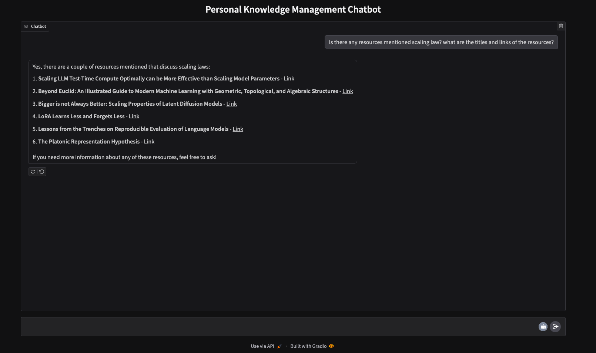

# Personal Knowledge Management Chatbot



## **Introduction**

This project focuses on creating a personal knowledge management chatbot to enable efficient retrieval of information from a custom knowledge base. The knowledge base (https://jokerdii.github.io/di-blog) consists of markdown files documenting monthly readings, including article titles, links, and personal comments. The chatbot uses **Retrieval-Augmented Generation (RAG)** to combine vector-based retrieval with generative AI, ensuring precise and contextually relevant answers to user queries. The application is built with **Gradio** for a user-friendly interactive interface.

## **Data Processing Pipeline**

1. **Document Loading**: The chatbot uses **LangChain's DirectoryLoader** to read and process markdown files stored in a hierarchical folder structure. Each document is enriched with metadata, including its document type, to facilitate organized processing.
2. **Text Splitting**: Content is split into manageable chunks using **LangChain's CharacterTextSplitter**, ensuring that documents can be processed efficiently and relevant segments are retrieved during queries.
3. **Vector Embedding and Storage**: Chunks are embedded using **OpenAI Embeddings**, converting text into high-dimensional vectors that capture semantic relationships. These embeddings are stored in a **FAISS vector database**, enabling fast and accurate retrieval.

## **Retrieval-Augmented Generation (RAG)**

The chatbot employs **RAG** by integrating a retriever and a generative language model. The **retriever** queries the **FAISS vector database** for relevant content, while the **GPT-4o-mini** model generates responses based on retrieved data. This ensures contextually relevant answers, even for complex or nuanced queries.

## **Conversation Management**

To maintain a coherent and context-aware interaction, the chatbot incorporates a **Conversational Retrieval Chain** from LangChain. This chain combines the **GPT-4o-mini** model, the **retriever**, and a **ConversationBufferMemory**, which retains chat history to provide context across multiple exchanges.

## **User Interface**

The chatbot is deployed using **Gradio**, offering a simple and intuitive chat interface. Users can input natural language queries and receive dynamically generated responses that reference relevant articles from their knowledge base.

## **Technical Highlights**

- **Retrieval-Augmented Generation (RAG)** ensures precise and relevant responses by combining retrieval and generation.
- **FAISS Vector Database** provides scalable and efficient storage for high-dimensional embeddings, allowing for rapid retrieval of content.
- **LangChain Framework** streamlines document loading, text splitting, and conversational chain management.
- **Gradio Interface** enhances accessibility and usability through an interactive chat platform.

## **Applications**

The chatbot enables users to revisit and synthesize past readings by querying the knowledge base using natural language prompts. This makes it a valuable tool for knowledge organization and review, facilitating efficient retrieval without manual searches.

## Usage

Clone this repo (https://github.com/JoKerDii/knowledge-management-chatbot.git):

```bash
git clone https://github.com/JoKerDii/knowledge-management-chatbot.git
cd knowledge-management-chatbot
```

Create a virtual environment:
```
python -m venv llm_venv
```

Activate the virtual environment:
```bash
source llm_venv/bin/activate
```

Download required dependencies:
```
pip install -r requirements.txt
```

Create `.env` file and add OpenAI API Key:

```bash
echo "OPENAI_API_KEY=sk-*******" | cat > .env
```

Run the application locally:

```bash
python3 app.py
```